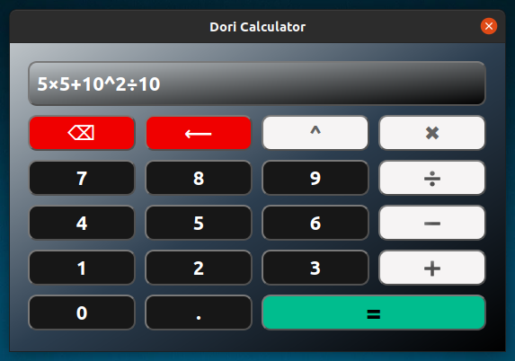

# Advanced Calculator

Advanced GUI Calculator with Beautiful UI and Clear Code.

#



#

#

# Install PyQt5

## Windows

```
pip3 install PyQt5
```

## Linux

```
pip3 install PyQt5
sudo apt install python3-pyqt5
sudo apt install pyqt5-dev-tools
sudo apt install qttools5-dev-tools
```

## Mac

```
pip3 install PyQt5
brew install pyqt5
```

[how to use](https://raw.githubusercontent.com/dori-dev/demo-calculator/main/guide.mkv)
